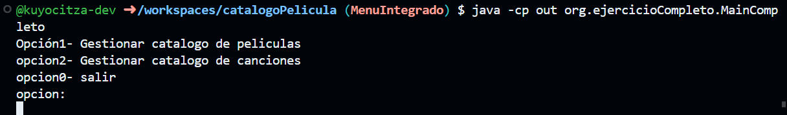

# pantallas de funcionamiento
### menu Principal que da acceso a las dos clases (Peliculas y Canción):

### opcion que lleva a clase Pelicula (opcion1):
no se muestra el funcionamiento de las opciones del menu de la clase peliculas ya que ya se demostro en la rama main.

### opcion que lleva a la clase Cancion (opcion2):
Al igual que la clase anterio no se mostrara lo que el menu de esta clase hace ya que ya se mostro en sus capturas en la rama cancion

### demostracion de que la opcion salir funciona:

